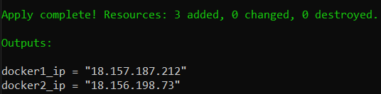
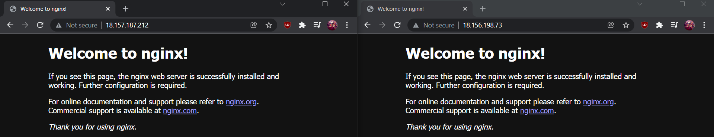

Firstly, you have to have install Ansible and Terraform on Linux host machine.
If you have Windows host machine, you can either use WSL(Windows Subsystem for Linux) or install Linux distribution of your choice on virtual machine, such as Oracle Virtualbox. You can find a guide on how to do this and install Ansible here: https://phoenixnap.com/kb/install-ansible-on-windows. You also have to download Terraform, which you can do here: https://www.terraform.io/downloads.html.
After this, you have to clone my GitHub repository, to get Ansible Playbook and config and Terraform file. Here is the the link(SSH): git@github.com:Globart1337/Luxoft_DevOps.git.
Then you have to go to clonned folder, and run these commands:
``` 
terraform init
terraform apply (press "yes" when prompted)
``` 
Terraform will create 2 instances, and execute Ansible playbook on each of them. The playbook will update existing and install required packages, add Docker repository to your host, install Docker and run nginx image with port 80 published. After this, Terraform will output the IP`s of your instances, which you can visit to test the status of nginx server.

